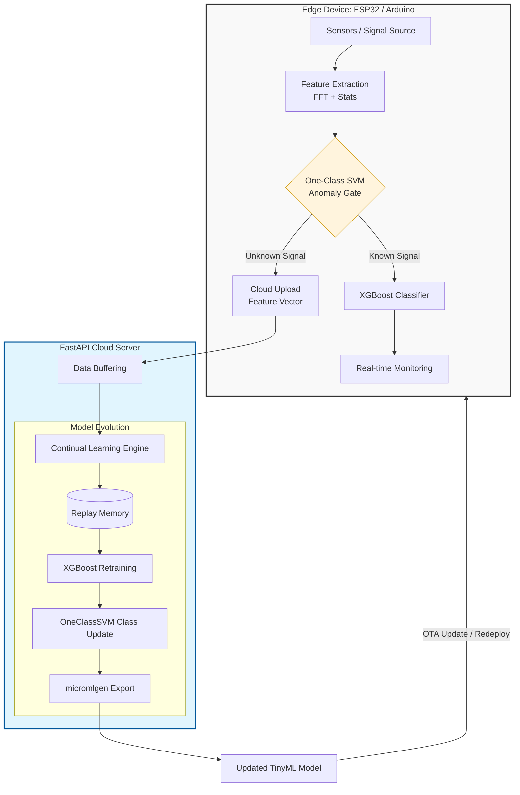

# Edge-Cloud Continual Learning for Machine Signal Monitoring

An **Edge AI + Cloud Continual Learning** system designed to monitor machine signals and automatically adapt to new machine types without retraining from scratch. 

This project implements a hybrid architecture where embedded devices perform real-time inference while the cloud manages **Class Incremental Learning (CIL)** when novel signal patterns emerge.

---

## 📌 Problem Statement
Industrial environments are dynamic; new machines or signal patterns appear over time. Traditional ML models suffer from **catastrophic forgetting**, where learning a new task causes the model to lose previous knowledge, or they require expensive, full-dataset retraining.

**This project solves this by implementing:**
* **Anomaly Detection:** Edge devices identify unknown patterns locally.
* **Incremental Learning:** Cloud-based processing of new data classes.
* **Automatic Evolution:** Continuous model updates to the edge without losing prior intelligence.

---

## 🏗 System Architecture

The system bridges low-power hardware with scalable cloud compute:



---

## ✨ Key Features
* **TinyML Inference:** Real-time execution on resource-constrained microcontrollers.
* **Anomaly Gate:** One-Class SVM triggers learning cycles only when necessary.
* **CIL Strategy:** Uses replay memory to prevent knowledge loss.
* **Automated Pipeline:** Cloud retraining and model versioning built with FastAPI.
* **Feature Engineering:** Dual-domain (Time & Frequency) extraction for robust health profiling.

---

## 📊 Signal Features
The system extracts **11 core features** from sensor windows:

| Domain | Feature | Description |
| :--- | :--- | :--- |
| **Time** | RMS | Root Mean Square energy |
| | Variance | Signal spread/dispersion |
| | Peak Amplitude | Maximum signal excursion |
| | Skewness | Symmetry of the distribution |
| | Kurtosis | "Tailedness" of the signal profile |
| | Crest Factor | Ratio of peak to RMS |
| **Frequency** | Dominant Freq | Primary oscillation frequency |
| | Spectral Entropy | Complexity/randomness of the spectrum |
| | Low Band Energy | Energy in the lower frequency range |
| | Mid Band Energy | Energy in the middle frequency range |
| | High Band Energy | Energy in the higher frequency range |

---

## ⚙️ Machine Learning Pipeline

### 1. Edge Phase
* **Feature Extraction:** Real-time processing of raw sensor data.
* **Gating:** If the One-Class SVM marks a signal as "Unknown," the feature vector is transmitted to the Cloud API.

### 2. Cloud Phase
* **Data Buffering:** Collects samples of the new machine state.
* **Exemplar Management:** Selects representative samples of previous classes.
* **Incremental Training:** Retrains the XGBoost model on the augmented dataset.
* **Export:** Generates a new `model.h` file for the microcontroller.

---

## 🔄 Dataset Evolution
The system tracks knowledge growth through versioned datasets:
* **v1:** CWRU vibration dataset (Baseline).
* **v2:** Vibration + IMU classes.
* **v3:** Vibration + IMU + Voltage signals.

---

## 🛠 Tech Stack
* **Embedded:** Arduino, ESP32, TinyML, `micromlgen`
* **ML Frameworks:** XGBoost, Scikit-learn (One-Class SVM)
* **Backend:** FastAPI, Python, REST APIs
* **Signal Processing:** NumPy, SciPy (FFT & Statistics)

---

## 📁 Project Structure
```text
├── src/           # Edge firmware (C++/Arduino)
├── include/       # TinyML model headers (model.h)
├── lib/           # Supporting C++ libraries
├── test/          # Hardware testing utilities
├── data/          # Exemplar datasets & versioning
├── cloud/         # FastAPI training pipeline & logic
└── requirements.txt
```

## Roadmap
- [x] Edge feature extraction pipeline  
- [x] Anomaly detection gate  
- [x] Cloud retraining pipeline  
- [x] Versioned exemplar memory  
- [x] TinyML model export  
- [ ] Next Step: ESP32 WiFi integration for automated data upload  
- [ ] Over-the-Air (OTA) model updates  
- [ ] Cloud deployment (AWS/Azure)  
- [ ] CI/CD pipeline for automated model updates  

## License
This project is licensed under the MIT License.

##Authors
***AJ***